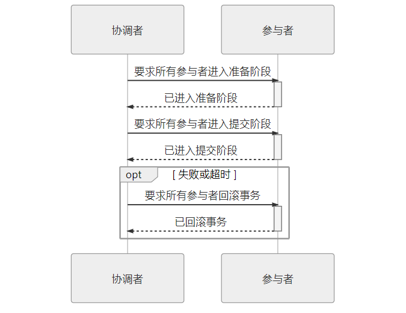
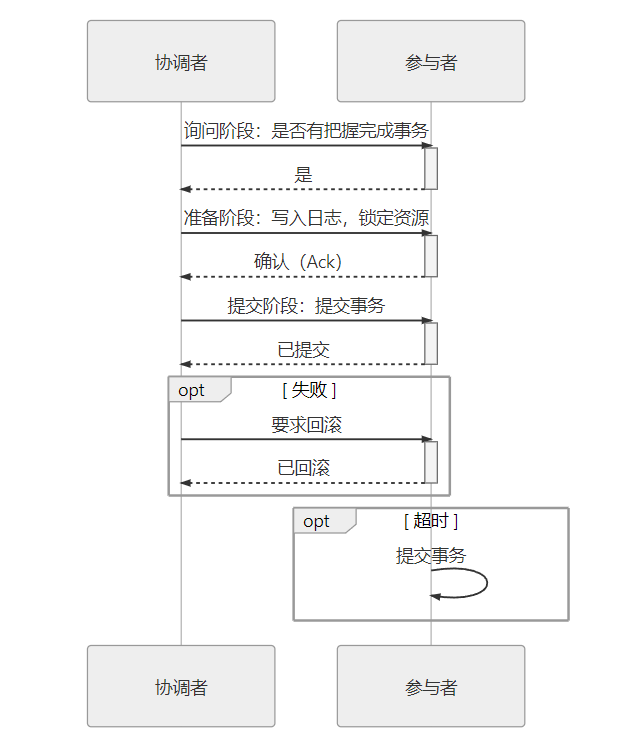
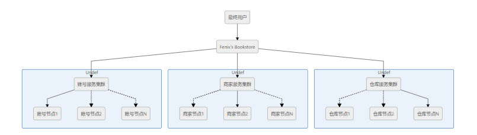

# 分布式

> 以下主要内容是阅读《凤凰架构》以及查阅相关资料后的知识记录与个人感想

## 系统架构演变

### 原始分布式时代

> 二十世纪九十年代，计算机硬件局促的原酸处理能力已经直接妨碍到单台计算机上信息系统软件能够达到的最大规模，计算机各界开始寻找使用多台计算机写作支撑一套软件系统运行的可行方案。`分布式运算环境（DCE）`也应运而生，同时带来许多问题。以`调用远程方法`为例：**远程的服务在哪里呢（服务发现），有多少个服务呢（负载均衡)，网络出现分区、超时或者服务出错怎么办呢（熔断、隔离、降级），方法的参数与返回结果如何表示（序列化协议），信息如何传输（传输协议），服务权限如何管理（认证、授权），如何保证通信安全（网络安全层），如何令调用不同机器的服务返回相同的结果（分布式数据一致性）等等**。虽然当时的DCE很尽力的回答出其中大部分问题，然而受限于时代背景，难堪大用。

### 单体系统时代

> 随着计算机硬件发展，**单体架构**逐渐称为主流，不仅**易于开发、测试、部署，而且避免了进程间通信，效率很高**，而且同样的可以进行分层架构的设计。但与此同时**由于模块、方法间没有隔离，意味着系统的一部分出现问题，可能会导致更严重的后果**，比如内存泄漏、线程爆炸、阻塞、循环、端口号或数据池泄露等等，甚至会影响集群中其它副本的工作！

### SOA时代

> 为了对大型的单体系统进行拆分，让每一个子系统都能独立地部署、运行、更新，开发者们曾经尝试过多种方案，这里列举以下三种较有代表性的架构模式：

1. 烟囱式架构：对于不发生交互的信息系统，使用独立的数据库和服务器实现拆分

2. 微内核架构：集中公共服务、数据、资源，构造一个被所有业务系统共同依赖的核心，具体的业务系统以插件模块（Plug-in Modules）的形式存在，这样也可提供可扩展的、灵活的、天然隔离的功能特性。整个图
   
   

3. 事件驱动架构：通过建立一套事件队列管道，实现子系统间的相互通信

> 最终，SOA（面向服务的架构）诞生嘞，它拥有领导制定技术标准的组织 Open CSA；有清晰软件设计的指导原则，譬如服务的封装性、自治、松耦合、可重用、可组合、无状态，等等；明确了采用 SOAP 作为远程调用的协议，依靠 SOAP 协议族（WSDL、UDDI 和一大票 WS-*协议）来完成服务的发布、发现和治理；利用一个被称为[企业服务总线](https://zh.wikipedia.org/zh-hans/企业服务总线)（Enterprise Service Bus，ESB）的消息管道来实现各个子系统之间的通信交互，令各服务间在 ESB 调度下无须相互依赖却能相互通信，既带来了服务松耦合的好处，也为以后可以进一步实施[业务流程编排](https://zh.wikipedia.org/wiki/业务流程管理)（Business Process Management，BPM）提供了基础；使用[服务数据对象](https://zh.wikipedia.org/wiki/服务数据对象)（Service Data Object，SDO）来访问和表示数据，使用[服务组件架构](https://zh.wikipedia.org/wiki/服务组件架构)（Service Component Architecture，SCA）来定义服务封装的形式和服务运行的容器，等等。在这一整套成体系可以互相精密协作的技术组件支持下，若仅从技术可行性这一个角度来评判的话，SOA 可以算是成功地解决了分布式环境下出现的主要技术问题。

### 微服务时代

> **微服务架构（Microservices）**
> 
> 微服务是一种通过多个小型服务组合来构建单个应用的架构风格，这些服务围绕业务能力而非特定的技术标准来构建。各个服务可以采用不同的编程语言，不同的数据存储技术，运行在不同的进程之中。服务采取轻量级的通信机制和自动化的部署机制实现通信与运维。

围绕业务能力构建、分散治理：服务对应开发团队直接对服务运行质量负责，并且可以不受外界干扰的实现服务（被各方服务所依赖的基础服务除外嘞、通过服务实现独立自治的组件：即选择远程调用、产品化思维、数据去中心化、强终端弱管道、容错性设计、演进式设计、基础设施自动化

### 后微服务时代

> k8s+istio，相较于spring cloud所提供的软件微服务，后微服务更偏向于将一些基础功能当作基础设施，不需要实现代码来完成服务治理

### 无服务时代

> 云计算！云端系统！神中神！后端设施在云中，业务逻辑代码运行在云中！哦耶！

## 架构技术详解

### 访问远程服务

#### RPC

> 历史目的是让**计算机能够跟调用本地方法一样去调用远程方法**。这里引出进程间通信(IPC)的概念，实现方法可大致分为以下几种：

1. 管道/具名管道：普通管道只用于有亲缘关系进程（由一个进程启动的另外一个进程）间的通信，具名管道摆脱了普通管道没有名字的限制，除具有管道所有的功能外，它还允许无亲缘关系进程间的通信。管道典型的应用就是命令行中的`|`操作符，譬如：
   
   ```shell
   ps -ef | grep java
   ```
   
   `ps`与`grep`都有独立的进程，以上命令就通过管道操作符`|`将`ps`命令的标准输出连接到`grep`命令的标准输入上。

2. 信号：**首先需要强调，这个和信号量不是一个东西哦！**信号用于通知目标进程有某种事件发生，除了用于进程间通信外，进程还可以发送信号给进程自身。信号的典型应用是`kill`命令，譬如：
   
   ```bash
   kill -9 pid
   ```

3. 信号量：信号量用于两个进程之间同步协作手段，它相当于操作系统提供的一个特殊变量，程序可以在上面进行`wait()`和`notify()`操作。

4. 消息队列：以上三种方式只适合传递传递少量信息，POSIX 标准中定义了消息队列用于进程间数据量较多的通信。进程可以向队列添加消息，被赋予读权限的进程则可以从队列消费消息。消息队列克服了信号承载信息量少，管道只能用于无格式字节流以及缓冲区大小受限等缺点，但实时性相对受限。

5. 共享内存：允许多个进程访问同一块公共的内存空间，这是效率最高的进程间通信形式。原本每个进程的内存地址空间都是相互隔离的，但操作系统提供了让进程主动创建、映射、分离、控制某一块内存的程序接口。当一块内存被多进程共享时，各个进程往往会与其它通信机制，譬如信号量结合使用，来达到进程间同步及互斥的协调操作。

6. 套接字接口：消息队列和共享内存只适合单机多进程间的通信，套接字接口是更为普适的进程间通信机制，可用于不同机器之间的进程通信。**实现网络通信！**

通过IPC，我们将走进RPC，其定义为：**位于互不重合的内存地址空间中的两个程序，在语言层面上，以同步的方式使用带宽有限的信道来传输程序控制信息。**为实现这一目标，需要解决三个基本问题：

1. **如何表示数据**：双方进程可能使用不同硬件指令集、不同操作系统下，可能同样的数据类型也完全可能有不一样的表现细节！**序列化解决**
2. **如何传递数据**：通过网络，如何让两个服务的终端相互操作，交换数据！**在TCP、UDP、IP等等协议上进行发展的Wire Protocol协议**
3. **如何确定方法**：不同的语言的方法签名可能有所区别，需要建立跨语言的统一标准！**IDL，接口描述语言：UUID神中神**

#### REST

> 严格意义上REST（表征状态转移）并不是远程服务调用协议，甚至并不是一种协议，仅仅是一种远程调用方式。在**浏览器端用的比较多，**因为以浏览器作为前端，对于传输协议、序列化器这两点都不会有什么选择的权力！用HTTP就可以直接进行。核心概念如下：

- **资源**（Resource）：譬如你现在正在阅读一篇名为《REST 设计风格》的文章，这篇文章的内容本身（你可以将其理解为其蕴含的信息、数据）我们称之为“资源”。无论你是购买的书籍、是在浏览器看的网页、是打印出来看的文稿、是在电脑屏幕上阅读抑或是手机上浏览，尽管呈现的样子各不相同，但其中的信息是不变的，你所阅读的仍是同一份“资源”。
- **表征**（Representation）：当你通过电脑浏览器阅读此文章时，浏览器向服务端发出请求“我需要这个资源的 HTML 格式”，服务端向浏览器返回的这个 HTML 就被称之为“表征”，你可能通过其他方式拿到本文的 PDF、Markdown、RSS 等其他形式的版本，它们也同样是一个资源的多种表征。可见“表征”这个概念是指信息与用户交互时的表示形式，这与我们软件分层架构中常说的“表示层”（Presentation Layer）的语义其实是一致的。
- **状态**（State）：当你读完了这篇文章，想看后面是什么内容时，你向服务器发出请求“给我下一篇文章”。但是“下一篇”是个相对概念，必须依赖“当前你正在阅读的文章是哪一篇”才能正确回应，这类在特定语境中才能产生的上下文信息即被称为“状态”。我们所说的有状态（Stateful）抑或是无状态（Stateless），都是只相对于服务端来说的，服务器要完成“取下一篇”的请求，要么自己记住用户的状态：这个用户现在阅读的是哪一篇文章，这称为有状态；要么客户端来记住状态，在请求的时候明确告诉服务器：我正在阅读某某文章，现在要读它的下一篇，这称为无状态。
- **转移**（Transfer）：无论状态是由服务端还是客户端来提供的，“取下一篇文章”这个行为逻辑必然只能由服务端来提供，因为只有服务端拥有该资源及其表征形式。服务器通过某种方式，把“用户当前阅读的文章”转变成“下一篇文章”，这就被称为“表征状态转移”。

#### 区别与联系

> REST的基本思想是面向资源来抽象问题，它与此前流行的编程思想——面向过程的编程在抽象主体上有本质的差别。在 REST 提出以前，人们设计分布式系统服务的唯一方案就只有 RPC，RPC 是将本地的方法调用思路迁移到远程方法调用上，开发者是围绕着“远程方法”去设计两个系统间交互的。这样做的坏处不仅是“如何在异构系统间表示一个方法”、“如何获得接口能够提供的方法清单”都成了需要专门协议去解决的问题（RPC 的三大基本问题之一），更在于服务的每个方法都是完全独立的，服务使用者必须逐个学习才能正确地使用它们。

按通俗的话来说我们写代码的时候，RPC是引用包直接是调用函数，REST是调用服务的接口API。所以同一个集群的服务间调用，一般会用RPC的方式，集群外部服务调用应该是对接API的方式。

### 事务处理

> 所有的事务都需要遵守一个公共原则ACID：即原子性、一致性、隔离性、持久性。在单机情况下，一致性是由原子性、隔离性、持久性合力保证，是编码所能解决的问题，然而在分布式系统中却不尽然

#### 本地事务

> 本地事务指仅操作单一事务资源的、不需要全局事务管理器进行协调的事务，适用于单个服务使用单个数据源的场景。

实现原子性和持久性主要是保证数据能够成功正确的写入磁盘，可以用提交日志(主流方式)，但是也有使用影子分页(大体思路是对数据的变动会写到硬盘的数据中，但并不是直接就地修改原先的数据，而是先将数据复制一份副本，保留原数据，修改副本数据。在事务过程中，被修改的数据会同时存在两份，一份是修改前的数据，一份是修改后的数据，这也是“影子”（Shadow）这个名字的由来。当事务成功提交，所有数据的修改都成功持久化之后，最后一步是去修改数据的引用指针，将引用从原数据改为新复制出来修改后的副本，最后的“修改指针”这个操作将被认为是原子操作，现代磁盘的写操作可以认为在硬件上保证了不会出现“改了半个值”的现象。)的SQLite Version3！

实现隔离性的主要方法是加锁，读写锁、范围锁、行锁、表锁！！！好多锁

**在本地事务中，通过保证AID来实现C是可行的**

#### 全局事务

> 全局事务就是单节点多数据源的事务嘞，换个翻译方式就是多个库但是同一个服务器

此处由于需要一次性执行多个事务的提交，如果其中一个事务失败，而其它事务已经提交成功，这个时候即使我们需要对所有的事务都进行回滚，但需要面对无法回滚的问题！怎么办？这里提出两段式提交、以及三段式提交。

先讲讲两段式提交(**不是MySQL的两段式提交！！！**)，分为两个阶段。**准备阶段**：在redo log中记录全部事务提交操作所要做的内容，但是并不真正提交，不写入commit record！先等着其它事务观察情况；**提交阶段**：如果在准备阶段所有的事务都准备好嘞，就在本地持久化事务为Commit，并向其它事务通知，如果有其他事务说自己没准备好，或者没有回复，就执行回滚操作。这里其实引入了一个协调者的概念，它负责观察事务的所有参与者，并负责向其它参与者发送回滚指令。但是这种协议也存在一个问题，如果网络通信中出现误差的话，提交失败了是无法补救的，一个节点如果不能恢复正常运行的话所有的参与者都熄火啦！



三段式提交在两段式提交上更进一步，将准备阶段分为CanCommit、PreCommit两个阶段，提交阶段称为DoCommit阶段。将准备阶段一分为二的理由是这个阶段是重负载的操作，一旦协调者发出开始准备的消息，每个参与者都将马上开始写重做日志，它们所涉及的数据资源即被锁住，如果此时某一个参与者宣告无法完成提交，相当于大家都白做了一轮无用功。所以，增加一轮询问阶段，如果都得到了正面的响应，那事务能够成功提交的把握就比较大了，这也意味着因某个参与者提交时发生崩溃而导致大家全部回滚的风险相对变小。



#### 共享事务

这一块不细说啦，和本地事务也差不多，就是需要一个中间服务器来给多个服务提供数据源

#### 分布式事务

先讲CAP！！！分布式之神

- 一致性（Consistency）：代表数据在任何时刻、任何分布式节点中所看到的都是符合预期的
- 可用性（Availability）：代表系统不间断地提供服务的能力
- 分区容忍性（Partition Tolerance）：代表分布式环境中部分节点因网络原因而彼此失联后，即与其他节点形成“网络分区”时，系统仍能正确地提供服务的能力

这里用下凤凰架构里的例子，希望帮助自己理解



在这套系统中，每一个单独的服务节点都有自己的数据库（这里是为了便于说明问题的假设，在实际生产系统中，一般应避免将用户余额这样的数据设计成存储在多个可写的数据库中），假设某次交易请求分别由“账号节点 1”、“商家节点 2”、“仓库节点 N”联合进行响应。当用户购买一件价值 100 元的商品后，账号节点 1 首先应给该用户账号扣减 100 元货款，它在自己数据库扣减 100 元很容易，但它还要把这次交易变动告知本集群的节点 2 到节点 N，并要确保能正确变更商家和仓库集群其他账号节点中的关联数据，此时将面临以下可能的情况。

- 如果该变动信息没有及时同步给其他账号节点，将导致有可能发生用户购买另一商品时，被分配给到另一个节点处理，由于看到账号上有不正确的余额而错误地发生了原本无法进行的交易，此为一致性问题。
- 如果由于要把该变动信息同步给其他账号节点，必须暂时停止对该用户的交易服务，直至数据同步一致后再重新恢复，将可能导致用户在下一次购买商品时，因系统暂时无法提供服务而被拒绝交易，此为可用性问题。
- 如果由于账号服务集群中某一部分节点，因出现网络问题，无法正常与另一部分节点交换账号变动信息，此时服务集群中无论哪一部分节点对外提供的服务都可能是不正确的，整个集群能否承受由于部分节点之间的连接中断而仍然能够正确地提供服务，此为分区容忍性。

以上还仅仅涉及了账号服务集群自身的 CAP 问题，对于整个 Fenix's Bookstore 站点来说，它更是面临着来自于账号、商家和仓库服务集群带来的 CAP 问题，譬如，用户账号扣款后，由于未及时通知仓库服务中的全部节点，导致另一次交易中看到仓库里有不正确的库存数据而发生超售。又譬如因涉及仓库中某个商品的交易正在进行，为了同步用户、商家和仓库的交易变动，而暂时锁定该商品的交易服务，导致了的可用性问题，等等。

- **如果放弃分区容忍性**（CA without P），意味着我们将假设节点之间通信永远是可靠的。永远可靠的通信在分布式系统中必定不成立的，这不是你想不想的问题，而是只要用到网络来共享数据，分区现象就会始终存在。在现实中，最容易找到放弃分区容忍性的例子便是传统的关系数据库集群，这样的集群虽然依然采用由网络连接的多个节点来协同工作，但数据却不是通过网络来实现共享的。以 Oracle 的 RAC 集群为例，它的每一个节点均有自己独立的 SGA、重做日志、回滚日志等部件，但各个节点是通过共享存储中的同一份数据文件和控制文件来获取数据的，通过共享磁盘的方式来避免出现网络分区。因而 Oracle RAC 虽然也是由多个实例组成的数据库，但它并不能称作是分布式数据库。
- **如果放弃可用性**（CP without A），意味着我们将假设一旦网络发生分区，节点之间的信息同步时间可以无限制地延长，此时，问题相当于退化到前面“全局事务”中讨论的一个系统使用多个数据源的场景之中，我们可以通过 2PC/3PC 等手段，同时获得分区容忍性和一致性。在现实中，选择放弃可用性的 CP 系统情况一般用于对数据质量要求很高的场合中，除了 DTP 模型的分布式数据库事务外，著名的 HBase 也是属于 CP 系统，以 HBase 集群为例，假如某个 RegionServer 宕机了，这个 RegionServer 持有的所有键值范围都将离线，直到数据恢复过程完成为止，这个过程要消耗的时间是无法预先估计的。
- **如果放弃一致性**（AP without C），意味着我们将假设一旦发生分区，节点之间所提供的数据可能不一致。选择放弃一致性的 AP 系统目前是设计分布式系统的主流选择，因为 P 是分布式网络的天然属性，你再不想要也无法丢弃；而 A 通常是建设分布式的目的，如果可用性随着节点数量增加反而降低的话，很多分布式系统可能就失去了存在的价值，除非银行、证券这些涉及金钱交易的服务，宁可中断也不能出错，否则多数系统是不能容忍节点越多可用性反而越低的。目前大多数 NoSQL 库和支持分布式的缓存框架都是 AP 系统，以 Redis 集群为例，如果某个 Redis 节点出现网络分区，那仍不妨碍各个节点以自己本地存储的数据对外提供缓存服务，但这时有可能出现请求分配到不同节点时返回给客户端的是不一致的数据。

由于CAP三者不能同时满足，P是分布式自带的特性，A是所有服务的共同追求，往往大多是系统只能满足AP，而追求最终一致性，所谓的最终一致性指的是如果数据在一段时间之内没有被另外的操作所更改，那它最终将会达到与强一致性过程相同的结果。具体要如何实现呢？这里就引出几种不同的分布式事务机制

1. **可靠事件队列**：这是一种尽最大可能交付的方法，是将最有可能出错的业务以本地事务的方式完成后，采用不断重试的方式（不限于消息系统）来促使同一个分布式事务中的其他关联业务全部完成。
2. **TCC事务**：侵入性比较强，但是提供强隔离性！
3. **SAGA事务**：将一个分布式环境中的大事务分解为一系列本地事务的设计模式

### 透明多级分流系统

#### 客户端缓存

大体可以分为强制缓存和协商缓存，对于**强制协商**而言：假设在某个时点到来以前，譬如收到响应后的 10 分钟内，资源的内容和状态一定不会被改变，因此客户端可以无须经过任何请求，在该时点前一直持有和使用该资源的本地缓存副本；对于**协商缓存**而言：其基于变化检测的缓存机制，在一致性上会有比强制缓存更好的表现，但需要一次变化检测的交互开销，性能上就会略差一些。

#### 域名解析

> DNS的作用是将人类便于理解的域名地址转换为便于计算机处理的IP地址，大概步骤如下：

1. 客户端先检查本地DNS缓存，查看是否存在存活着的域名地址记录。这里引出存活时间的概念，DNS只能通过存活时间超期后的重新获取来保证域名的对应IP地址是正确嘚！
2. 客户端将地址发送给本机操作系统配置中的本地DNS，可以手工配置，也可以DHCP分配或者拨号时从PPP服务器中自动获取
3. 本地DNS受到查询请求后，会按照“是否有`www.icyfenix.com.cn`的权威服务器”→“是否有`icyfenix.com.cn`的权威服务器”→“是否有`com.cn`的权威服务器”→“是否有`cn`的权威服务器”的顺序，依次查询自己的地址记录，如果都没有查询到，就会一直找到最后点号代表的根域名服务器(.)为止。
   - 权威域名服务器：负责翻译特定域名的 DNS 服务器，“权威”意味着这个域名应该翻译出怎样的结果是由它来决定的。
   - 根域名服务器：是指固定的、无需查询的[顶级域名](https://en.wikipedia.org/wiki/Top-level_domain)（Top-Level Domain）服务器，可以默认为它们已内置在操作系统代码之中。全世界一共有 13 组根域名服务器

#### 传输链路

> 有很多优化原则，从以下内容大体进行介绍

1. **减少请求数量**：请求每次都需要建立通信链路进行数据传输，这些开销很昂贵，减少请求的数量可有效的提高访问性能，对于前端开发者
2. **扩大并发请求数**：现代浏览器（Chrome、Firefox）一般对每个域名支持 6 个（IE 为 8-13 个）并发请求，如果希望更快地加载大量图片或其他资源，需要进行域名分片（Domain Sharding），将图片同步到不同主机或者同一个主机的不同域名上。
3. **启用压缩传输**：启用压缩传输：启用压缩能够大幅度减少需要在网络上传输内容的大小，节省网络流量。
4. **避免页面重定向**：避免页面重定向：当页面发生了重定向，就会延迟整个文档的传输。在 HTML 文档到达之前，页面中不会呈现任何东西，降低了用户体验。
5. **按重要性调节资源优先级**：将重要的、马上就要使用的、对客户端展示影响大的资源，放在 HTML 的头部，以便优先下载。

#### 内容分发网络

> 解决跨运营商、跨地域物理距离所导致时延问题，能为网站流量带宽起到分流、减负的作用

1. 路由解析：首先需要理解DNS解析，DNS的解析过程大致为浏览器->本地DNS->权威DNS->根服务器->域名服务器（在域名服务器会给出更具体的域名服务器，直到可以进行解析以获取ip地址)。而cdn进行路由解析时，会先返回一个CNAME记录，通过CNAME递归查询，可以直接找到多个对应记录，这些就是分布在世界各地但存有网址缓存的CDN节点哦！换句话说也就是，根服务器被CNAME的权威DNS替代，并且解析路径会去往CDN服务器
2. 内容分发：CDN缓存节点接管用户向服务器发起的资源请求，通过从缓存源站资源进行响应。获取源站资源的过程就被称作内容分发。一般情况下可以分为两种主要的方式，第一种是主动分发，比方说有一些网站可能需要预载大量资源的场景，像双十一啊啥的，各个商城就会把未来活动中所需要用到的资源推送到CDN缓存节点中，甚至一些特别常用的资源会直接缓存到手机APP的存储空间和者浏览器的localStorgae中（关于这个概念，是HTML中新加入的一个特性，主要用作本地存储，解决cookie存储空间不足问题？一般浏览器中大小为5M）；另外一种就是被动回源：访问CDN缓存节点的时候，节点发现自己没有该资源，就会实时的从源站中获取
3. CDN应用：原来的主要目的是加速静态资源获取

#### 负载均衡

> 提到负载均衡，我的第一印象是nginx，提供反向代理之类的功能。《凤凰架构》一书中给出的解释是，调度后方的多台机器，以统一的接口对外提供服务的技术都叫负载均衡。书中还指出一般的大型负载均衡过程往往是多级的，大致可以分为两种：一为四层负载均衡，二为七层负载均衡。这里是对应OSI七层网络模型的概念，四层指的就是工作到传输层、七层指的是工作到应用层。OSI七层网络模型对于TCP/IP网络模型的主要变化是将应用层拓展成了会话层、表达层、应用层三层。在OSI模型中应用层的作用是提供服务接口

接下来简单介绍一下常见的负载均衡方法：

1. 数据链路层：这里需要一丢丢计网知识，实现MAC寻址借助于交换机以及MAC地址，我们可以通过二层交换机，修改请求数据帧的MAC目标地址，将原本发送给负载均衡器的数据帧转发给真实服务器，**真实服务器对客户端直接进行响应**。但是注意，更改MAC地址实际上并不影响ip地址，所以我们还要保证真实服务器的ip地址与ip数据包中的目标ip地址一致哦，这样效率很高，但是忽略了上层协议
2. 网络层：跟实现数据帧转发类似，可以通过改变目标ip地址实现数据包的转发。文中提到两种方式啊，一种是保持原有的不变，新创建一个包，新的数据包的目标ip地址是真实服务器的ip地址，PayLoad部分由原数据包的Headers和Payload共同组成，负载均衡器会帮忙处理新增的Headers部分，还原数据包交给真实服务器，由**真实服务器直接对客户端直接进行响应**；第二种方法就是大名鼎鼎的NAT模式，直接改变数据包Headers中的目标地址，直接发到真实服务器。由于客户端可能不认识真实服务器的ip，所以通过负载均衡器代为处理，请求发送给均衡器之后，均衡器修改目标ip地址，并自己发给真实服务器，真实服务器处理完请求后，会把响应发回均衡器，由均衡器把目标ip地址改回来，**对客户端请求做出响应**。不难看出，二者的区别在于，**前者是由真实服务器直接对客户端进行响应，后者则是由均衡器代为执行**
3. 应用层：这一层已经来到和地址没有关系的世界了！再也不用更改地址啦（或者应该叫转发）。在这里要进行负载均衡，我们需要的是代理。代理可以分为三种：正向、反向、透明，正向代理指的是客户端可见，服务端不可见；反向代理指的是客户端不可见，服务端可见；透明指的是双方都不可见（**不可见在这里叫透明**）。这里用简单的栗子解释一下，比方说访问一个域名可以通向多个服务器，客户端不知道具体的是哪一个服务器，就叫反向代理；比方说我访问github访问不到，开了个vpn访问，github不知道真实的访问者是我，只会知道vpn对应ip访问了它；透明代理的话，比方说大家伙一起用一个局域网，为了保证安全啊，需要用一种透明代理代为访问目标服务器，但是访问目标服务器其实还经过了一层“反向代理”。这样客户端和服务端都不知道对面的情况了。**这一层主要是处理更加具体的一些问题，比如解决500错误、过滤特定报文、防御SQL注入，可以从应用的逻辑，或者说更加接近于程序的逻辑来进行一些操作，而不像之前的四层均衡，无法处理TCP之上的一些问题**

接下来就需要在谈一谈均衡策略与实现，**均衡策略指的是，均衡器选择处理用户请求对象的方法**。这里介绍下一致性哈希均衡：根据请求中某些数据（比如地址啥的）进行哈希，保证同一个特征值总是落在某一台服务器上。一致性的意思是表示，当某台服务器挂了，不会影响其他服务器的哈希。

#### 服务端缓存

> 说实话，在看这篇文章之前，我向来认为在项目中引入缓存是很有必要的。客观上我知道引入缓存可能会提高系统的复杂度，带来缓存失效、更新、一致性问题，比如经典的redis缓存穿透、主从一致等等问题，但是我觉得这是我们可以解决的，克服的。所以能引入缓存的时候，就应该引入。然而从根源性的角度考虑，缓存之所以存在，是因为CPU或I/O能力的缺失，而且yi纳入缓存所带来的不仅仅是系统复杂度的问题，随之而来的还有安全问题、运维问题。所以，引入缓存是一件需要慎重考虑的问题。

1. 缓存属性：这里指的是设计或者选择缓存所需要考虑的一些因素：一是吞吐量，可以使用OPS值衡量，反映对缓存进行**并发**读、写操作的效率；二是命中率，缓存的命中率即成功从缓存中返回结果次数与总请求次数的比值；三是扩展功能，比如失效时间、事件；四是分布式支持：分为“进程内缓存”和“分布式缓存”两大类，可以简单理解为前者是本地的，后者是网络的
2. 缓存风险：主要有四个
   - 缓存穿透：每次查询的数据都是缓存中不存在的。首先是处理恶意的，**布隆过滤器**闪亮登场，可以以很小的代价判断元素在不在缓存中（本质是哈希运算+位数组），如果是业务中正常的，需要临时缓存一下查询的数据，如果后续该数据发生更改的话需要对缓存进行处理，一般来说是直接删除的，下次查不到再说
   - 缓存击穿：指本来数据在缓存中有的，结果出于某些原因没有在缓存中命中。首先是对于热点数据而言，可以通过代码加强管理，避免因为超时或什么原因自动失效，然后是对于短时间内大量请求无法处理的情况，可以选择加锁同步，将key值作为锁，只有一个请求可以落入真实数据源中。
   - 缓存雪崩：这是在缓存击穿的基础上，不止单个热点数据，而是大批不同数据同时发生缓存击穿。引发的原因可能是，大批数据一同加入，或者缓存服务崩溃啥的。要解决的话，从分布式的角度考虑建设集群，或者尽量不让大量数据在同一时间过期，可以设置一个区间上随机。
   - 缓存污染：这个是缓存和真实数据源数据不一致导致的，对于读而言没什么好说的，先读缓存，缓存没有读数据库，然后将数据库中的数据放入缓存。对于写而言的话，注意！！！这个在之前的笔记里也提到过，是先更新数据库，再删除缓存，不然会存在读操作引起缓存里有旧数据的问题。至于不更新缓存，一是麻烦，二是如果可能存在一旧一新的问题。

### 架构安全性

> 这里简单提一嘴，主要分为认证、授权、凭证、保密、传输、验证六个模块。使用的技术都是项目中经常用到的，比如OAuth2、Jwt、数据加解密等等。

## 分布式的基石

> 核心肯定是**CAP**啦！

### CAP理论

1. 一致性（Consistency）：代表数据在任何时刻、任何分布式节点中所看到的都是符合预期的
2. 可用性（Availability）：代表系统不间断地提供服务的能力
3. 分区容忍性（Partition Tolerance）：代表分布式环境中部分节点因网络原因而彼此失联后，即与其他节点形成“网络分区”时，系统仍能正确地提供服务的能力

一般来说，分布式都默认实现分区容忍性，一般会在C和A之间有所取舍

### 分布式共识算法

> 共识是什么？是达成一致性的方法和过程！分布式共识算法主要分为两种，强一致性算法和最终一致性算法

#### Paxos算法

分布式系统的三类节点：

1. **提案节点**：称为 Proposer，提出对某个值进行设置操作的节点，设置值这个行为就被称之为**提案**（Proposal），值一旦设置成功，就是不会丢失也不可变的（设置值可以理解为日志记录）
2. **决策节点**：称为 Acceptor，是应答提案的节点，决定该提案是否可被投票、是否可被接受。提案一旦得到过半数决策节点的接受，即称该提案被**批准**（Accept），提案被批准即意味着该值不能再被更改，也不会丢失，且最终所有节点都会接受该它。
3. **记录节点**：被称为 Learner，不参与提案，也不参与决策，只是单纯地从提案、决策节点中学习已经达成共识的提案，譬如少数派节点从网络分区中恢复时，将会进入这种状态。

**流程：**

1. 准备：如果某个提案节点准备发起提案，必须先向所有的决策节点广播一个许可申请（称为 Prepare 请求）。提案节点的 Prepare 请求中会附带一个全局唯一的数字 n 作为提案 ID，决策节点收到后，将会给予提案节点两个承诺与一个应答。

2. 批准：当提案节点收到了多数派决策节点的应答（称为 Promise 应答）后，可以开始第二阶段“批准”（Accept）过程，有如下两种可能

	1. 如果提案节点发现所有响应的决策节点此前都没有批准过该值（即为空），那说明它是第一个设置值的节点，可以随意地决定要设定的值，将自己选定的值与提案 ID，构成一个二元组“(id, value)”，再次广播给全部的决策节点（称为 Accept 请求）。
	2. 如果提案节点发现响应的决策节点中，已经有至少一个节点的应答中包含有值了，那它就不能够随意取值了，必须无条件地从应答中找出提案 ID 最大的那个值并接受，构成一个二元组“(id, maxAcceptValue)”，再次广播给全部的决策节点（称为 Accept 请求）

	当每一个决策节点收到 Accept 请求时，都会在不违背以前作出的承诺的前提下，接收并持久化对当前提案 ID 和提案附带的值。如果违反此前做出的承诺，即收到的提案 ID 并不是决策节点收到过的最大的，那允许直接对此 Accept 请求不予理会。当提案节点收到了多数派决策节点的应答（称为 Accepted 应答）后，协商结束，共识决议形成，将形成的决议发送给所有记录节点进行学习。


两个承诺是指：

- 承诺不会再接受提案 ID 小于或等于 n 的 Prepare 请求。
- 承诺不会再接受提案 ID 小于 n 的 Accept 请求。

一个应答是指：

- 不违背以前作出的承诺的前提下，回复已经批准过的提案中 ID 最大的那个提案所设定的值和提案 ID，如果该值从来没有被任何提案设定过，则返回空值。如果违反此前做出的承诺，即收到的提案 ID 并不是决策节点收到过的最大的，那允许直接对此 Prepare 请求不予理会。

## 分布式id

### 需求

分库分表环境中，数据库的自增主键不能满足主键唯一要求，伴随着海量的数据，需要生成海量的ID。分布式ID应运而生，它们从基本上要满足以下的要求：

1. **全局唯一**：ID全局唯一
2. **高性能**：分布式ID生成速度要快，本地资源消耗要小
3. **高可用**：生成分布式ID服务保证可用性无限接近于100%
4. **方便易用**：拿来即用，使用方便，快速接入

此外还需要满足一些进阶的要求，才可以称为是好的分布式ID

- **安全** ：ID 中不包含敏感信息。
- **有序递增** ：如果要把 ID 存放在数据库的话，ID 的有序性可以提升数据库写入速度。并且，很多时候 ，我们还很有可能会直接通过 ID 来进行排序。
- **有具体的业务含义** ：生成的 ID 如果能有具体的业务含义，可以让定位问题以及开发更透明化（通过 ID 就能确定是哪个业务）。
- **独立部署** ：也就是分布式系统单独有一个发号器服务，专门用来生成分布式 ID。这样就生成 ID 的服务可以和业务相关的服务解耦。不过，这样同样带来了网络调用消耗增加的问题。总的来说，如果需要用到分布式 ID 的场景比较多的话，独立部署的发号器服务还是很有必要的。

### 方案

#### 数据库号段模式

使用字段获取批量id，一批一批的SELECT来得到，对数据库的访问次数更少，数据库压力更小

**优点**：ID有序递增、存储消耗空间小

**缺点**：

32个16进制数字组成，JDK中有现成的生成UUID的方法

**优点**：生成速度比较快、简单易用

**缺点**：存储空间消耗大、不安全、无序、没有具体业务含义、需要解决重复ID问题

**使用方法**：jdk直接调用

#### 雪花算法

64bit二进制数字组成，1+41bit-时间戳+10bit-工作机器id+12bit序列号

- **第 0 位**： 符号位（标识正负），始终为 0，没有用，不用管。
- **第 1~41 位** ：一共 41 位，用来表示时间戳，单位是毫秒，可以支撑 2 ^41 毫秒（约 69 年）
- **第 42~52 位** ：一共 10 位，一般来说，前 5 位表示机房 ID，后 5 位表示机器 ID（实际项目中可以根据实际情况调整！在我最近写的项目里，给节点编号为1、1，以此类推的）。这样就可以区分不同集群/机房的节点。
- **第 53~64 位** ：一共 12 位，用来表示序列号。 序列号为自增值，代表单台机器每毫秒能够产生的最大 ID 数(2^12 = 4096),也就是说单台机器每毫秒最多可以生成 4096 个 唯一 ID。

**优点**：生成速度快、生成ID有序递增、比较灵活

**缺点**：如果机器时间不对，和之前一样，可能会产生重复ID（小概率事件）

**使用方法**：自己实现一个基于其原理的，或者调用开源框架，比如美团的Leaf
