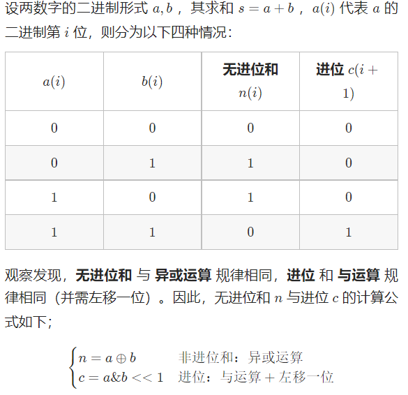

# 算法几章

> 平日里遇到的一些算法问题，或者一些有趣的算法

## 排序算法

> 最经典且适用性广泛的基础排序方法有冒泡、插入、选择排序！
>
> 之后有一些对基础排序算法做出改进的如希尔、归并、快速排序等等
>
> 当然也有一些特殊的排序方法如计数排序、桶排序等


> 接下来来实现下各大排序算法吧！

### 排序工具箱

记录排序结果的枚举

```java
package edu.neu.coding.sort.common;

/**
 * 排序值枚举
 * @author yato
 */

public enum SortedEnum {
    /**
     * 数组倒序排列值为-1
     * 数组正序排列值为1
     * 数组无序排列值为0
     */
    REVERSE_ORDER(-1), POSITIVE_ORDER(1), OUT_OF_ORDER(0);

    private final int value;

    /**
     * 默认带private修饰符号
     * @param value value
     */
    SortedEnum(int value) {
        this.value = value;
    }

    public int getValue() {
        return this.value;
    }
}
```

获取泛型Comparator的工具

```java
package edu.neu.coding.sort.util;

import java.util.Comparator;

/**
 * 获取Comparator的工具
 * @author yato
 */
public class ComparatorUtil {

    private ComparatorUtil() {}

    public static <T extends Comparable<T>> Comparator<T> getComparator() {
        return Comparator.naturalOrder();
    }
}
```

判断排序结果和交换元素的方法

```java
/**
 * 至少长度>=2 才能判断正序还是倒序，否则一律按正序算
 */
private static final int MIN_SIZE = 2;

private static <E extends Comparable<E>> void swap(E[] arr, int index1, int index2) {
    E temp = arr[index1];
    arr[index1] = arr[index2];
    arr[index2] = temp;
}

/**
 * 判断数组是否有序，并且以何顺序
 * @param arr 泛型数组
 * @return 数组的元素顺序
 * @param <E> 泛型元素
 */
public static <E extends Comparable<E>> SortedEnum getSortOrder(E[] arr) {
    Comparator<E> comparator = ComparatorUtil.getComparator();
    int len = arr.length;
    boolean ifPositiveOrder;
    if (len >= MIN_SIZE) {
        // 如果小于等于零，说明是正序的，反之则是倒序的
        ifPositiveOrder = comparator.compare(arr[0], arr[1]) <= 0;
    } else {
        ifPositiveOrder = true;
    }
    if (ifPositiveOrder) {
        for (int i = 1; i < len - 1; i++) {
            if (comparator.compare(arr[i], arr[i + 1]) > 0) {
                return SortedEnum.OUT_OF_ORDER;
            }
        }
    } else {
        for (int i = 1; i < len - 1; i++) {
            if (comparator.compare(arr[i], arr[i + 1]) < 0) {
                return SortedEnum.OUT_OF_ORDER;
            }
        }
    }
    return ifPositiveOrder ? SortedEnum.POSITIVE_ORDER : SortedEnum.REVERSE_ORDER;
}
```

### 冒泡排序

> 每次比较两个相邻元素，将较小的值或较大值依次传递至当前序列末尾，确保序列末端是最值后，缩短序列重复进行“冒泡操作”

```java
/**
 * 冒泡排序
 * @param arr 待排序数组
 * @param <E> 元素
 */
public static <E extends Comparable<E>> void bubbleSort(E[] arr) {
    Comparator<E> comparator = ComparatorUtil.getComparator();
    // 大循环n次
    for (int i = 0; i < arr.length; i++) {
        // 每次可以将最大的元素推至最后，小循环的次数会依次减一
        for (int j = 0; j < arr.length - 1 - i; j++) {
            if (comparator.compare(arr[j], arr[j + 1]) > 0) {
                swap(arr, j, j + 1);
            }
        }
    }
}
```

### 插入排序

> 从第二个元素开始，从后往前对已排序序列元素进行比较，如果序列中的元素值大于或小于当前值，则一直将序列中的元素右移(其实就是赋值操作arr[i] = arr[i-1])

```java
/**
 * 插入排序
 * @param arr 待排序数组
 * @param <E> 元素
 */
public static <E extends Comparable<E>> void insertSort(E[] arr) {
    Comparator<E> comparator = ComparatorUtil.getComparator();
    for (int i = 1; i < arr.length; i++) {
        E tmp = arr[i];
        // 从左到右比较
        int j = i;
        // 决定排列顺序
        while (j > 0 && comparator.compare(arr[j - 1], tmp) > 0) {
            // 右移动元素
            arr[j] = arr[j - 1];
            j--;
        }
        // 插入，赋值操作比较费时，j == i时的赋值是浪费时间，所以判断一下
        if (j != i) {
            arr[j] = tmp;
        }
    }
}
```

### 选择排序

> 很简单粗暴的方法。直接选出已排序序列余下序列的最值，放在未排序序列首就行，排序序列元素+1

```java
/**
 * 选择排序
 * @param arr 待排序数组
 * @param <E> 元素
 */
public static <E extends Comparable<E>> void selectSort(E[] arr) {
    Comparator<E> comparator = ComparatorUtil.getComparator();
    for (int i = 0; i < arr.length; i++) {
        int min = i;
        for (int j = i + 1; j < arr.length; j++) {
            if (comparator.compare(arr[min], arr[j]) > 0) {
                min = j;
            }
        }
        swap(arr, i, min);
    }
}
```

### 希尔排序

>将插入排序做了一点点小升级，可以将整个待排序的记录序列分割成为若干子序列分别进行直接插入排序，待整个序列中的记录“基本有序”时，再对全体记录进行依次直接插入排序

```java
/**
 * 希尔排序：对插入排序进行改进得到，
 * 会先将整个待排序的记录序列分割成为若干子序列分别进行直接插入排序
 * 待整个序列中记录基本有序时，再整合进行排序
 * @param arr 待排序数组
 * @param <E> 数组元素
 */
public static <E extends Comparable<E>> void shellSort(E[] arr) {
    Comparator<E> comparator = ComparatorUtil.getComparator();
    // 先获取最佳步长，一般来说是数组长度的三分之一左右
    int len = arr.length;
    int gap = 1;
    while (gap < len / Constant.THREE) {
        gap = gap * 3 + 1;
    }
    while (gap > 0) {
        for (int i = gap; i < len; i++) {
            E tmp = arr[i];
            int j = i;
            while (j > gap && comparator.compare(arr[j - gap], tmp) > 0) {
                arr[j] = arr[j - gap];
                j -= gap;
            }
            if (j != i) {
                arr[j] = tmp;
            }
        }
        gap = (int) Math.floor(gap / 3.0);
    }
}
```

### 归并排序

> 本质是分治的思想，将原数组拆分为左右两数组，直到左右数组的大小为2。这时拿出左右数组的首元素进行比较，依次拼接回来，生成新的有序的数组。
>
> 空间复杂度为O(n)，不为O(1)

```java
/**
 * 归并排序：采用分治方法，由上而下的进行排序
 * 基本原理是分成左右两个数组，依次拿出最小/大的元素，组成有序的新数组，两两向上形成最后排序的数组
 * @param arr 待排序数组
 * @param <E> 泛型元素
 */
public static <E extends Comparable<E>> void mergeSort(E[] arr) {
    Comparator<E> comparator = ComparatorUtil.getComparator();
    E[] sorted = mergeSort(comparator, arr);
    System.arraycopy(sorted, 0, arr, 0, arr.length);
}

private static <E extends Comparable<E>> E[] mergeSort(Comparator<E> comparator, E[] arr) {
    int arrLen = arr.length;
    // 两两比较，小于2就不用比
    if (arrLen < Constant.TWO) {
        return arr;
    }
    int mid = arr.length >> 1;
    E[] left = Arrays.copyOfRange(arr,0, mid);
    E[] right = Arrays.copyOfRange(arr, mid, arrLen);
    return merge(comparator, mergeSort(comparator, left), mergeSort(comparator, right));
}

@SuppressWarnings(value = "unchecked")
private static <E extends Comparable<E>> E[] merge(Comparator<E> comparator, E[] left, E[] right) {
    Class<E> eClass = (Class<E>) left[0].getClass();
    E[] result = (E[]) Array.newInstance(eClass, left.length + right.length);

    int i = 0;

    while (left.length > 0 && right.length > 0) {
        if (comparator.compare(left[0], right[0]) <= 0) {
            result[i++] = left[0];
            left = Arrays.copyOfRange(left, 1, left.length);
        } else {
            result[i++] = right[0];
            right = Arrays.copyOfRange(right, 1, right.length);
        }
    }

    while (left.length > 0) {
        result[i++] = left[0];
        left = Arrays.copyOfRange(left, 1, left.length);
    }

    while (right.length > 0) {
        result[i++] = right[0];
        right = Arrays.copyOfRange(right, 1, right.length);
    }
    return result;
}
```

### 快速排序

> 也是一种分治的方法，在当前序列中找出基准点，比基准点小的扔到左边去，比基准点大的扔到右边去，再不停的在子序列中操作，最终保证有序

```java
/**
 * 快速排序：本质是对冒泡排序进行改进
 * 1.选取基准点
 * 2.将比基准点小的元素移到基准点前，比基准点大的元素移到基准点后
 * 3.递归的操作子序列
 * 没有显示的申请额外空间，但是递归会用到log2n（N是递归层数）
 * @param arr 待排序数组
 * @param <E> 元素
 */
public static <E extends Comparable<E>> void quickSort(E[] arr) {
    Comparator<E> comparator = ComparatorUtil.getComparator();
    quickSort(arr, 0, arr.length - 1, comparator);
}

private static <E extends Comparable<E>> void quickSort(E[] arr, int left, int right, Comparator<E> comparator) {
    // 确定随机点
    if (left < right) {
        int partitionIndex = partition(arr, left, right, comparator);
        quickSort(arr, left, partitionIndex - 1, comparator);
        quickSort(arr, partitionIndex + 1, right, comparator);
    }
}

private static <E extends Comparable<E>> int partition(E[] arr, int left, int right, Comparator<E> comparator) {
    int pivot = Constant.RANDOM.nextInt(right - left) + left;
    // 直接交换左边界与基准点
    swap(arr, left, pivot);
    int l = left;
    int r = right;
    E tmp = arr[l];
    while (l < r) {
        // 从右向左比，如果当前元素比基准值小，移到基准值左边去
        while (l < r && comparator.compare(arr[r], tmp) >= 0) {
            r--;
        }
        if (l < r) {
            arr[l++] = arr[r];
        }
        while (l < r && comparator.compare(arr[l], tmp) <= 0) {
            l++;
        }
        if (l < r) {
            arr[r--] = arr[l];
        }
    }
    // 如果没进行交换，赋值相当于是无效的
    // 如果进行过交换，则是将原始的值保留了下来
    arr[l] = tmp;
    // l是新的基准点，返回
    return l;
}
```

### 堆排序

>将当前数组转换成最大/小堆，将最大/小元素移动到数组最后

```java
/**
 * 堆排序，优先队列，依次找出最大/小元素
 * 时间复杂度是O(nlog2n)的
 * @param arr 待排序数组
 * @param <E> 元素Class类型
 */
public static <E extends Comparable<E>> void heapSort(E[] arr) {
    Comparator<E> comparator = ComparatorUtil.getComparator();
    int len = arr.length;

    // 构建大顶堆
    for (int i = len / Constant.TWO; i>= 0; i--) {
        heapIfy(arr, i, len, comparator);
    }

    for (int i = len - 1; i > 0; i--) {
        // 堆顶是最大元素，移到最后
        swap(arr, 0, i);
        len--;
        // 把最后一位换到第一位后需要重新构造堆
        heapIfy(arr,0, len, comparator);
    }
}

/**
 * 创建堆
 * 其实整个过程就相当于保证子节点是比根节点小的
 * @param arr 数组
 * @param i 当前下标
 * @param len 数组长度
 * @param comparator comparator
 * @param <E> 元素类型
 */
private static <E extends Comparable<E>> void heapIfy(E[] arr, int i, int len, Comparator<E> comparator) {
    int left = 2 * i + 1;
    int right = 2 * i + 2;
    int largest = i;

    // 和左右的孩子比较，与最大的做交换
    if (left < len && comparator.compare(arr[left], arr[largest]) > 0) {
        largest = left;
    }
    if (right < len && comparator.compare(arr[right], arr[largest]) > 0) {
        largest = right;
    }

    if (largest != i) {
        swap(arr, i, largest);
        // 这一步是为了保证，交换后的子节点如果是根节点也必须是子树中最大的
        heapIfy(arr, largest, len, comparator);
    }
}
```

## 大数相乘

### 1.舍弃高位的做法

采用取模的方法把高位给去掉

### 2.使用因式分解

```java
public class Main {
    // n代表即将输入的数组大小
    // 要求的是[1,1] [1,2]...[1,n]...[2,2] [2,3]...[2,n]...[n-1,n]
    public static void main(String[] args) {
        Scanner cin = new Scanner(System.in);
        // 数字的数量
        int n = cin.nextInt();
        long[] aCount2 = new long[n];
        long[] aCount5 = new long[n];
        // 计算每个元素因式中2和5的个数
        for (int i = 0; i < n; i++) {
            long ai = cin.nextLong();
            long tmp = ai;
            while (tmp % 2 == 0) {
                tmp /= 2;
                aCount2[i]++;
            }
            tmp = ai;
            while (tmp % 5 == 0) {
                tmp /= 5;
                aCount5[i]++;
            }
        }
        long ans = 0L;
        for (int i = 0; i < n; i++) {
            long tmp2i = aCount2[i];
            long tmp5i = aCount5[i];
            ans += Math.min(tmp2i, tmp5i);
            for (int j = i + 1; j < n; j++) {
                tmp2i += aCount2[j];
                tmp5i += aCount5[j];
                ans += Math.min(tmp2i, tmp5i);
            }
        }
        System.out.println(ans);
    }
}
```

### 3.BigInteger

存储数据的时候采用的是int数组，相比于CPU内部存储采用补码的方式，BigInteger没有使用补码可能出于以下考虑：第一是已经通过sigNum标志正负数，判断0也很方便，不像CPU使用反码表示时，0的表示方法有11111111和00000000两种；第二是，如果使用补码进行存储，在乘法等操作时比较复杂（原码、补码的乘法方式有异）。

```java
BigInteger x = new BigInteger("12345678987654321234567898765432123456789");
BigInteger y = new BigInteger("98765432123456789876543212345678987654321");
System.out.println(x.multiply(y));
```

单独的算大数相乘的尾0的话，这样就可以了：

```java
public static int Method3(BigInteger x, BigInteger y){
    int ans = 0;
    x = x.multiply(y);
    System.out.println(x);
    BigInteger big10 = new BigInteger("10");
    BigInteger big0 = new BigInteger("0");
    while (!x.equals(big0) && x.mod(big10).equals(big0)) {
        ans++;
        x = x.divide(big10);
    }
    return ans;
}
```

## KMP

kmp是一种字符串匹配算法，

### 1.求next数组

```java
public void getNext(char[] pattern) {
    int j = -1;
    next[0] = j;
    for (int i = 1; i < pattern.length; i++) {
    	while(j >= 0 && pattern[i] != pattern[j+1]) j = next[j];
    	if(pattern[i] == pattern[j+1]) j++;
    	next[i] = j;
    }
}
```

### 2.求解模板串在文本串中的位置

```java
public int strStr(char[] text, char[] pattern) {
	int j = -1;
	for(int i = 0; i < text.length; i++) {
		while(j >= 0 && text[i] != pattern[j+1]) j = next[j];
		if(j && text[i] == pattern[j+1]) j++;
		if(j == pattern.length - 1) return j;
	}
	return -1;
}
```

## top-K

> 以求前k小为例，大致上可以分为三种方法
>
> 1. 整个数组排序
> 2. 使用优先队列（小顶堆、大顶堆
> 3. 快排子步骤：partition

### 1.Arrays.sort直接全部排序

```java
int[] ans = new int[k];
if (k == 0) return ans;
Arrays.sort(arr);
for (int i = 0; i < k; i++) {
    ans[i] = arr[i];
}
return ans;
```

### 2.PriorityQueue堆排序

```java
int[] ans = new int[k];
if (k == 0) return ans;
// 构造大顶堆，默认是小顶堆
PriorityQueue<Integer> heap = new PriorityQueue<>(Comparator.reverseOrder());
for (int i = 0, len = arr.length; i < len; i++) {
    int size = heap.size();
    // 比arr[i]大就得弹出去了，说明肯定不是前k小的
    if (size == k && heap.peek() <= arr[i]) continue;
    if (size == k) heap.poll();
    heap.offer(arr[i]);
}
for (int i = 0; i < k; i++) {
    ans[i] = heap.poll();
}
return ans;
```

### 3.quickSort子步骤

```java
private static final Random random = new Random(System.currentTimeMillis());

public int[] smallestK(int[] arr, int k) {
    if (k == 0) {
        return new int[0];
    }

    int len = arr.length;
    int left = 0;
    int right = len - 1;
    // 找下标是 k - 1 的那个数，由于在循环过程中 left <= right 一定成立，因此写 while (true)  就可以
    while (true) {
        int index = partition(arr, left, right);
        if (index == k - 1) {
            break;
        } else if (index < k - 1) {
            left = index + 1;
        } else {
            right = index - 1;
        }
    }

    int[] res = new int[k];
    System.arraycopy(arr, 0, res, 0, k);
    return res;
}

private int partition(int[] arr, int left, int right) {
    // 随机选择 arr[left..right] 中的元素作为 pivot，为什么传 right - left + 1 请见代码后的「说明」
    int randomIndex = left + random.nextInt(right - left + 1);
    swap(arr, left, randomIndex);

    // 保持循环不变的性质：lt 是 less than 的缩写
    // arr[left + 1..lt] < pivot
    // arr(lt..i) >= pivot
    int lt = left;
    int pivot = arr[left];
    for (int i = left + 1; i <= right; i++) {
        if (arr[i] < pivot) {
            lt++;
            swap(arr, i, lt);
        }
    }

    // 这一步比较容易忘掉，必须要交换以后返回 lt
    swap(arr, left, lt);
    return lt;
}

private void swap(int[] arr, int index1, int index2) {
    int temp = arr[index1];
    arr[index1] = arr[index2];
    arr[index2] = temp;
}
```

## LRU

> LRU是最近最少使用的意思，意味着当加入某个数据时，如果当前的缓存空间已经到达上限，需要删除最长时间没有使用的数据。具体来说，LRU需要实现两个方法，且get方法和put方法都以O(1)的平均时间复杂度运行。
>
> 由此可以想到相关的满足get方法的数据结构有数组和哈希表，满足put方法的数据结构有链表。又考虑到对象以键值对的形式存储，哈希表自然是不可缺少，所以还是可以想到哈希表组合链表的数据结构。

### 1.LinkedHashMap实现

```java
class LRUCache {
    private int capacity;
    private LinkedHashMap<Integer, Integer> cache;

    public LRUCache(int capacity) {
        this.capacity = capacity;
        cache = new LinkedHashMap<>(capacity,0.75F ,true){
            @Override
            protected boolean removeEldestEntry(Map.Entry<Integer, Integer> eldest) {
                return size() > capacity;
            }
        };
    }
    public int get(int key) {
        return cache.getOrDefault(key, -1);
    }
    public void put(int key, int value) {
        cache.put(key,value);
    }
}
```

### 2.哈希表+双向链表实现

```java
class LRUCache {
    class DLinkedNode {
        int key;
        int value;
        DLinkedNode prev;
        DLinkedNode next;
        public DLinkedNode() {}
        public DLinkedNode(int _key, int _value) {key = _key; value = _value;}
    }

    private Map<Integer, DLinkedNode> cache = new HashMap<Integer, DLinkedNode>();
    private int size;
    private int capacity;
    private DLinkedNode head, tail;

    public LRUCache(int capacity) {
        this.size = 0;
        this.capacity = capacity;
        // 使用伪头部和伪尾部节点
        head = new DLinkedNode();
        tail = new DLinkedNode();
        head.next = tail;
        tail.prev = head;
    }

    public int get(int key) {
        DLinkedNode node = cache.get(key);
        if (node == null) {
            return -1;
        }
        // 如果 key 存在，先通过哈希表定位，再移到头部
        moveToHead(node);
        return node.value;
    }

    public void put(int key, int value) {
        DLinkedNode node = cache.get(key);
        if (node == null) {
            // 如果 key 不存在，创建一个新的节点
            DLinkedNode newNode = new DLinkedNode(key, value);
            // 添加进哈希表
            cache.put(key, newNode);
            // 添加至双向链表的头部
            addToHead(newNode);
            ++size;
            if (size > capacity) {
                // 如果超出容量，删除双向链表的尾部节点
                DLinkedNode tail = removeTail();
                // 删除哈希表中对应的项
                cache.remove(tail.key);
                --size;
            }
        }
        else {
            // 如果 key 存在，先通过哈希表定位，再修改 value，并移到头部
            node.value = value;
            moveToHead(node);
        }
    }

    private void addToHead(DLinkedNode node) {
        node.prev = head;
        node.next = head.next;
        head.next.prev = node;
        head.next = node;
    }

    private void removeNode(DLinkedNode node) {
        node.prev.next = node.next;
        node.next.prev = node.prev;
    }

    private void moveToHead(DLinkedNode node) {
        removeNode(node);
        addToHead(node);
    }

    private DLinkedNode removeTail() {
        DLinkedNode res = tail.prev;
        removeNode(res);
        return res;
    }
}
```

## N皇后

```java
class Solution {
    private int ans = 0;
    // 某一层放在某个位置
    private HashMap<Integer, Integer> map = new HashMap<>();

    private void backTrack(int n, int curLayer) {
        if (n == curLayer) {
            ans++;
            return;
        }

        for (int i = 0; i < n; i++) {
            // 当前列被用过
            if (map.containsValue(i))
                continue;
            boolean flag = true;
            for (int j = 0; j < curLayer; j++) {
                // 第j层所使用列，说明不满足条件
                int val = map.get(j);
                if (val == i - curLayer + j || val == i + curLayer - j) {
                    flag = false;
                    break;
                }
            }
            if (flag) {
                map.put(curLayer, i);
                backTrack(n , curLayer + 1);
                map.remove(curLayer);
            }
        }
    }

    public int totalNQueens(int n) {
        backTrack(n, 0);
        return ans;
    }
}
```

## N数之和

1. 暴力dfs嘛，时间复杂度相当高勒
2. 小小优化，当最终到达二数之和时使用神奇双指针
3. 递归+双指针+后缀和剪枝！神奇连招，这个得整点代码

```c++
class Solution {
    vector<long long> postsum;
    void init(vector<int>& nums) {           // (1)
        int i, n = nums.size();
        postsum.resize(n + 1);
        postsum[n] = 0;
        sort(nums.begin(), nums.end());
        for(i = n-1; i >= 0; --i) {
            postsum[i] = postsum[i+1] + nums[i];
        }
    }

    vector<vector<int>> nSum(int n, vector<int> & nums, int l, int r, int target) {
        vector <vector<int> > ret;
        int i, j;
        if(n == 1) {                         // (2)
            for(i = l; i <= r; ++i) {
                if(nums[i] == target) {
                    ret.push_back({target});
                    break;
                }
            }
            return ret;
        }
        if(n == 2) {
            while(l < r) {
                int now = nums[l] + nums[r];
                if(now > target) {
                    --r;
                }else if(now < target) {
                    ++l;
                }else {
                    ret.push_back( {nums[l], nums[r]});
                    ++l;
                    --r;
                    while(l < r && nums[l] == nums[l-1]) ++l;
                    while(l < r && nums[r] == nums[r+1]) --r;
                }
            }
        }
        for(i = l; i <= r - (n-1); ++i) {
            if(i > l && nums[i] == nums[i-1]) {
                continue;
            }
            if(nums[i] + postsum[r - (n-1) + 1] < target) {
                continue;                    // (3)
            }
            if(postsum[i] - postsum[i+n] > target) {
                break;                       // (4)
            }

            vector <vector<int> > v = nSum(n-1, nums, i+1, r, target - nums[i]);
            for(j = 0; j < v.size(); ++j) {
                v[j].push_back(nums[i]);
                ret.push_back(v[j]);
            }
        }
        return ret;
    }
}
```

## 动态规划

### 动态规划五部曲

1. **定义dp数组**：要清楚为什么这样定义，理解下标的含义。
2. **得出推导公式**：也就是状态转移方程。一般来说可以通过揣测当前状态可以由什么状态变换得来，或者说当前状态可以变换成什么状态得出
3. **初始化dp数组**：动态规划是通过之前的状态得到下一个状态，那么初始状态的定义就尤其重要，是所有其它数组元素的起源嘞
4. **循环遍历构造dp数组**：都弄清楚了写代码构造就好，但是要滤清遍历顺序啥的
5. **验证一下**

### 背包问题

**01背包问题**

背包问题的起源，还得是01背包，要解决的问题是：有n件物品和一个最多能背重量为w 的背包。第i件物品的重量是weight[i]，得到的价值是value[i] 。**每件物品只能用一次**，求解将哪些物品装入背包里物品价值总和最大？

从动态规划五部曲来讲：

1. 如果是定义二维数组的话，那么行表示物品编号，j表示当前使用背包的容量，数组元素值表示当前行列对应条件下可以放入的最大价值；一维数组是由二维数组推导而来，dp[j]表示背包容量为j时，背包所装的最大价值
2. 前面提到一维dp由二维dp化简而来，如何化简？且看推导公式，首先我们知道，对于一个物品，只有装和不装两种选择，所以遍历到下一个物品之前，最大值一定从前一个物品不装或装转换而来。我们转换成代码就是

dp[i][j] = Math.max(dp[i-1][j], dp[i-1][j-Ci] + Wi);

蛤，糕手一下就可以发现dp[i-1]是相同的，真的需要记录吗？答案昭然若揭，不必

dp[j] = Math.max(dp[j], dp[j-Ci] + Wi);

那么神奇的问题又来了，这个dp[j]，我要怎么得到啊！对于01背包而言，每个物品只能装一次，如果我们还是从前往后推导，由于没有记录当前物品是否放入，那么会有重复的嫌疑！所以我们从后往前推导，就可以得到正确的dp[j]

3. 二维数组和一维数组的初始化都很简单哟，只要初始化背包容量为0时的可装载最大价值为0就行嘞

4. 在推导公式里已差不多讲了，此处不赘述，直接上代码嘞

```java
//对于二维数组
for(int i = 1; i <= 物品数; i++) {
 for(int j = 1; j <= 背包最大重量; j++) {
     dp[i][j] = Math.max(dp[i-1][j], dp[i-1][j-Ci] + Wi);
 }
}

//对于一维数组
for(int i = 1; i <= 物品数; i++) {
 // 到Ci就表示只装装不了当前物品咯！
 for(int j = 背包最大重量; j >= Ci; j--) {
     dp[j] = Math.max(dp[j], dp[j-Ci] + Wi);
 }
}
```

5. 到这里，验证一下就完事了

**完全背包问题**

在经过01背包问题后，我们就可以走进完全背包的世界。他俩唯一的区别在于，相较于01背包，完全背包中的每件物品可以使用无限次。所以二者其实只在推导式子上有一点点小区别，之前在01背包的一维dp提到一个可能重复添加物品的问题，对于完全背包而言那就是正正好。

无需多言，整个代码

```java
for(int i = 1; i <= 物品数; i++) {
// 到Ci就表示只装装不了当前物品咯！
for(int j = Ci; j <= 背包最大重量; j--) {
 dp[j] = Math.max(dp[j], dp[j-Ci] + Wi);
	}
}
```

### 股票问题

这个问题最大的核心在于，当前是否持有股票这一状态所能获取的最大利润。挑一个经典的最多买卖k笔交易，问最大收益，老规矩是走一个动规五部曲。

1. 首先是定义dp数组，第i天状态为j，所剩下的最大现金的对应元素值。j的状态表示为：0 表示不操作；1 第一次买入；2 第一次卖出；3 第二次买入；4 第二次卖出......**除了0以外，偶数就是卖出，奇数就是买入**。
2. 能进行的操作有三种，买入、卖出、啥也不干。但是对应的状态可以有四种！啥也不干对应的两种是，啥也不干但是是买入状态、啥也不干但是是卖出状态。那么对应的状态转换也是毕竟容易推导出的
3. 怎么初始化嘞？当然是让第一天的所有买入状态记为-Prices[0]，卖出状态记为0啦
4. 这一步基本上看第二步，没有啥特殊情况，就是记得区分现在是第几次买入卖出
5. 最后验证一下嘛，有啥子好说的嘞！

### 编辑距离

给你两个单词 word1 和 word2，请你计算出将 word1 转换成 word2 所使用的最少操作数 。动规五部曲走起！

1. **dp(i)(j)表示以下标i-1为结尾的字符串word1，和以下标j-1为结尾的字符串word2，最近编辑距离为dp(i)(j)**。

2. 先分析下有几种操作，第一种是哇塞一模一样，不用操作嘞；第二种是哇塞不一样，需要操作嘞！操作有哪几种呢？增删改查，不外乎此！具体而言就是增删改啦！取出增删改所需要的对应最小步数就行

	```text
	if (word1[i - 1] == word2[j - 1])
	  不操作
	if (word1[i - 1] != word2[j - 1])
	  增
	  删
	  换
	```

3. 来初始化了，想想定义，如果对方为空字符串，不得把自己字符串全删了吗！事实上就是这样嘚，初始化就是这个道理

4. 初始化完就遍历，这个主要也看第二步，也没啥需要特别注意的，这种问题中是正常遍历

5. 验证下！

### 树形dp

打家劫舍Ⅲ！题目描述：在上次打劫完一条街道之后和一圈房屋后，小偷又发现了一个新的可行窃的地区。这个地区只有一个入口，我们称之为“根”。 除了“根”之外，每栋房子有且只有一个“父“房子与之相连。一番侦察之后，聪明的小偷意识到“这个地方的所有房屋的排列类似于一棵二叉树”。 如果两个直接相连的房子在同一天晚上被打劫，房屋将自动报警。计算在不触动警报的情况下，小偷一晚能够盗取的最高金额。老规矩，动规五部曲，不过因为是树的关系，可能还需要递归

1. 确定dp数组，简单点！整一个一维dp，只用记录偷还是不偷。那么有的同学可能就会问了，哎呀！我只记录偷或不偷，哪能行啊。我最后得返回偷到的最大金额呢！欸，这个偷或不偷，需要在递归的过程中判断，到底怎么偷，把一整个偷的过程囊括在当前的偷或不偷当中
2. 好嘞，既然状态只有两种，操作自然只有两种了，偷或不偷，但是根据之前的描述，如果当前节点不偷，我们要判断之后的孩子偷不偷，判断一棵树中偷的所有过程
3. 初始化！没啥好初始化的，一开始米米为0嘛
4. 遍历，递归，判断左右孩子偷没偷
5. 还那个验证

## 约瑟夫环

问题本身可以抽象为将0,1,···,n-1这n个数字排成一个圆圈，从数字0开始，每次从这个圆圈里删除第m个数字（删除后从下一个数字开始计数）。求出这个圆圈里剩下的最后一个数字。

**这里给出一个解题的思路例子**，0、1、2、3、4这5个数字组成一个圆圈，从数字0开始每次删除第3个数字，则删除的前4个数字依次是2、0、4、1，因此最后剩下的数字是3。

第一轮是 [0, 1, 2, 3, 4] ，所以是 [0, 1, 2, 3, 4] 这个数组的多个复制。这一轮 2 删除了。

第二轮开始时，从 3 开始，所以是 [3, 4, 0, 1] 这个数组的多个复制。这一轮 0 删除了。

第三轮开始时，从 1 开始，所以是 [1, 3, 4] 这个数组的多个复制。这一轮 4 删除了。

第四轮开始时，还是从 1 开始，所以是 [1, 3] 这个数组的多个复制。这一轮 1 删除了。

最后剩下的数字是 3。

> **从上面的过程中，如果我们倒着来看，不难发现一些规律，从最后一轮出发，只会剩下一个数字，这个时候对应数组的下标为0，所以我们可以设置一个初始值index为0。然后，如果我们想要回到2个数的数组的话，不妨将index的值设为，(index + 3) % 2，这一步就有点抽象了，但是其实也不难理解。因为我们要从数组的两个元素中挑一个，又是报数报到3，这一步之后我们不难发现被选中留下的是这个只有两个变量的临时数组的第二个元素嘞！。在这一步的基础上，如果想要回到3个数的数组的话，是不是很自然的联想到，其为(index + m) % 3。！！！照这个思路进行下去，我们要找到在原数组中被选中留下的数的位置。即index！有了index，找出对应数字岂不是手到擒来！代码就长这样啦！**
>
> ```java
> int index = 0;
> for (int i = 2; i <= n; i++) {
> index = (index + m) % i;
> }
> return index;
> ```


## 位运算

位运算是一个说起来很轻巧，但是实际写起来比较困难的东西，这里会总结一些常见的基本知识和一些位运算题目。

首先呢！常见的位运算符有&、|、^、~、>>、<<几种，分别为与、或、异或、取反、右移、左移，其中与和异或用的尤其频繁：

**与（&）**

- **取数a的二进制最低位**：对a按位与1，即a&1。如3（011），取其最低位3&1，得到1。
- **lowbit操作：**lowbit(x) 即 x&(-x)，可以取出二进制数的最后一个1，比如6(110)，6&(-6)得(10)。

**异或（^）**

- **满足交换律和结合率，**（ a^b=b^a、a^(b^c)=(a^b)^c ）
- **任何数和其自身做异或运算，结果是 0**，即 a^a=0。
- **任何数和0做异或运算，结果仍然是原来的数**，即 a^0=a。

接下来通过几道经典的题目来了解！

**第一招：力扣136.只出现一次的数字**

当当当，这道题直接对所有值进行异或，留下来的就是那个独一无二的数字！

```java
public int singleNumber(int[] nums) {
    int ans = 0;
    for (int num : nums) {
        ans ^= num;
    }
    return ans;
}
```

**第二招：力扣191.位1的个数**

当当当，这道题直接直接求当前最低位是否为1，然后高位补0一直右移，直到为0为止，这个过程中如果为1记得记录！上个代码吧：

```java
public int hammingWeight(int n) {
    int ans = 0;
    while (n != 0) {
        ans += n&(-n)&1;
        // 无符号右移，高位补0！
        n = n >>> 1;
    }
    return ans;
}
```

**第三招：剑指Offer 64.求1+2+...+n**

当当当！这道题是要实现通过与来实现短路！用递归，而不用条件语句来判断中止，好耶！上代码：

```java
public int sumNums(int n) {
    // 第二个式子用恒成立的就行
    boolean tmp = n > 1 && sumNums(n-1) > 0;
    ans += n;
    return ans;
}
```

**第四招：剑指Offer 65.不用加减乘除做加法**

这里借一张k神的图！



所以理论上，没有进位的时候只需要异或一下，如果有进位的话需要记录进位(这里的进位是直接记录的对应位上的值，用异或直接+上就可以了!)，因为不能用加法的缘故，我们必须要等到进位变成0，这样我们就不用加法啦！狠狠的偷一张图：


走一个代码：

```java
if (b == 0) {
    return a;
}
// 转换成非进位和 + 进位
return add(a ^ b, (a & b) << 1);
```

